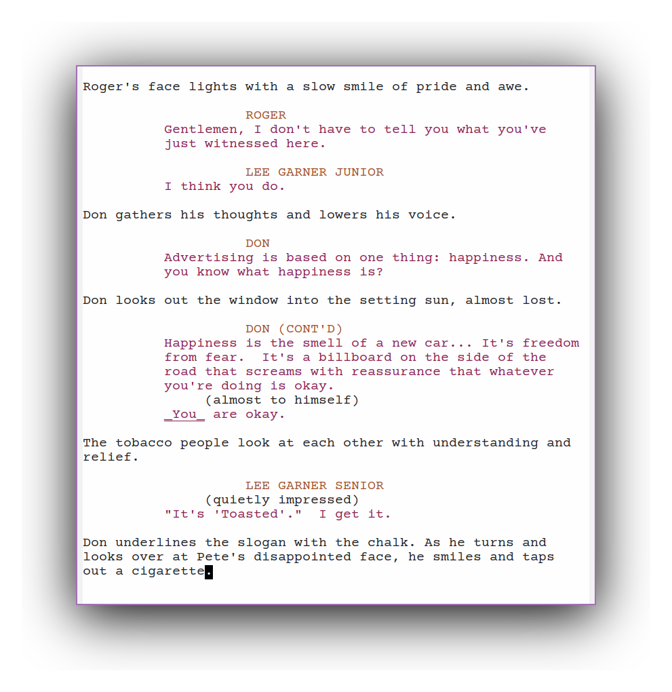

# emacs-screenwriting-config

My Emacs config for screenwriting.



Emacs packages used: ``evil``, ``fountain-mode``, ``olivetti``, ```hide-mode-line```.

Other dependencies: ``Node.js``, ``npm``, ``Afterwriting CLI`` (pdf export), ``Courier Prime`` font.

## Installation & Usage

1. Install [Courier Prime font](https://quoteunquoteapps.com/courierprime/).
2. Clone the repository.
3. Install ``Afterwriting CLI``: ``npm install afterwriting -g``.
4. Create a directory that will serve as a separate emacs home directory for this config.
5. Move ``.emacs`` and ``afterwriting-config.js`` to the new directory.
6. Edit ``launch.sh``: set the ``SCREENPLAYS_HOME`` variable to the path of the new directory.
7. Rename ``launch.sh`` to your liking and move it to your preferred directory for executables. Use it to launch emacs.
8. Add your customizations to ``.emacs`` and ``afterwriting-config.js``.

Fountain-mode and olivetti should launch automatically upon opening a ``.fountain`` file. Saving a modified ``.fountain`` file should trigger a generation of a ``.pdf`` file for the screenplay.
